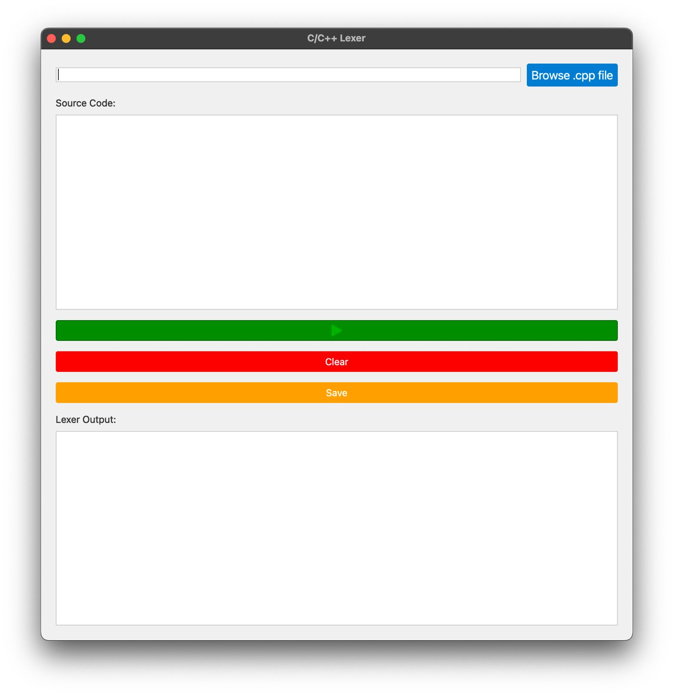

# PARSER_GUI_SAMPLE1

This project is a parser for a simple language with basic operations, featuring a graphical user interface (GUI) built using Python and C++. The lexer tokenizes the source code and displays the tokens in a GUI.

## Features

- Tokenizes source code of a simple language
- Displays tokens in a GUI
- Supports file input and direct code input
- Provides options to run, clear, and save the code
- Executes two different projects and displays their outputs in separate text areas

## Requirements

- Python 3.x
- PyQt5
- C++ compiler (e.g., g++)

## Installation

1. Clone the repository:
    ```sh
    git clone https://github.com/ChristoferNVR2/PARSER_GUI_SAMPLE1.git
    cd PARSER_GUI_SAMPLE1
    ```

2. Set up a Python virtual environment:
    ```sh
    python3 -m venv venv
    source venv/bin/activate  # On Windows use `venv\Scripts\activate`
    ```

3. Install the required Python packages:
    ```sh
    pip install PyQt5
    ```

4. Build the C++ lexer:
    ```sh
    mkdir build
    cd build
    cmake ..
    make
    ```

## Usage

1. Run the GUI application from gui directory:  
    ```sh
    cd gui 
    python gui.py
    ```

2. Use the GUI to browse for a C++ file or enter C++ code directly.

3. Click the **Run** button to tokenize the code and display the tokens.

4. Use the **Clear** button to clear the input and output fields.

5. Use the **Save** button to save the entered code to a file.

## Running the Application with Docker

To run the application using Docker, follow these steps:

1. Build the Docker image:
    ```sh
    docker-compose build
    ```
   
2. Start the Docker container:
    ```sh
    docker-compose up -d
    ```
   
3. Obtain the container ID:
    ```sh
    docker ps
    ```
   This will list all running containers. Look for the container ID of the `parser_gui` container.

4. Run the application in the container:
    ```sh
    docker exec --workdir=/app/gui <container_id> sh -c 'xvfb-run --auto-servernum sh -c cd gui && python3 gui.py'
    ```
   Replace `<container_id>` with the actual container ID obtained from the previous step.

## Screenshots

### Main Window


### Tokenized Output


## Project Structure

- `src/`: Contains the C++ source code for the parser.
- `flex/`: Contains the Flex lexer definition file.
- `bison/`: Contains the Bison parser definition file.
- `lexer/`: Contains the C++ source code for the lexer.
- `gui/`: Contains the Python GUI code.
- `res/`: Contains additional resources such as sample source files.
- `build/`: Directory for building the C++ lexer and parser.
- 
## Contributing

Contributions are welcome! Please open an issue or submit a pull request.

## License

This project is licensed under the MIT License. See the `LICENSE` file for details.